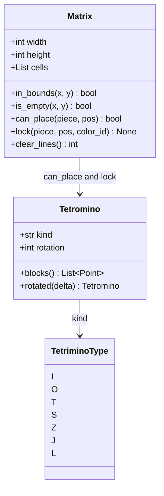
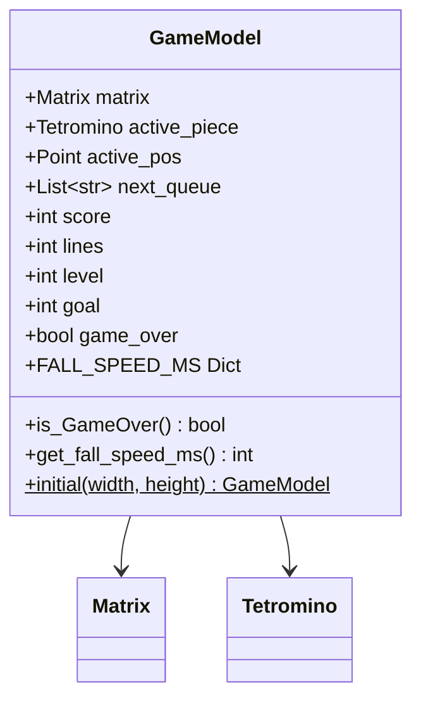
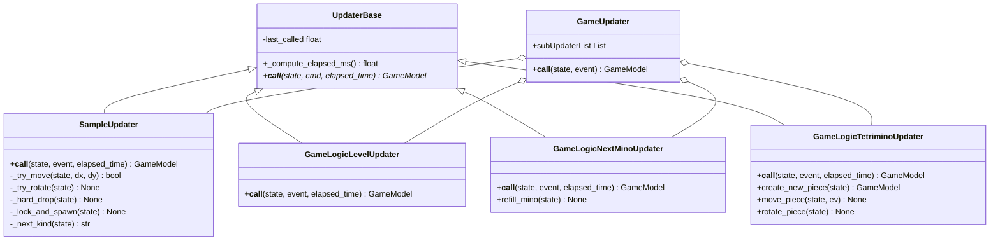
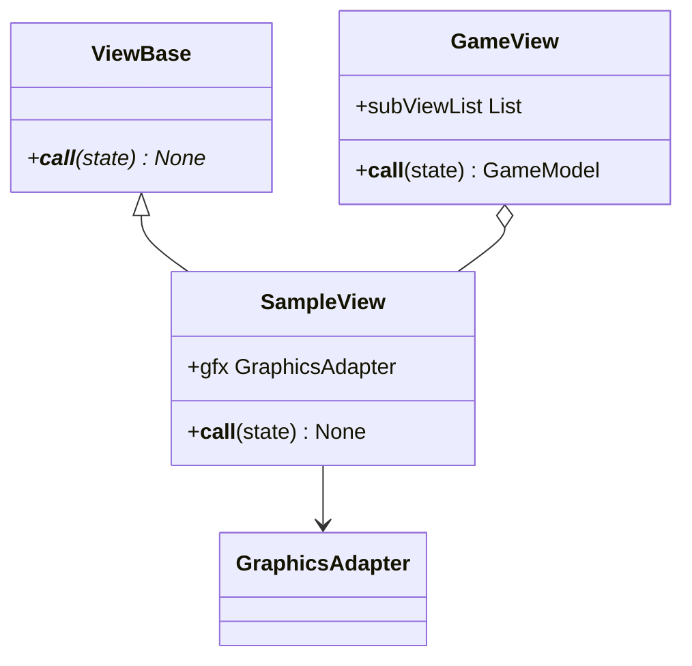
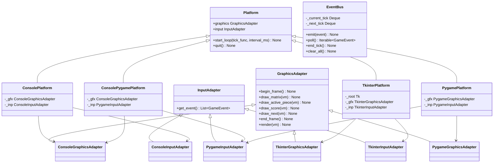
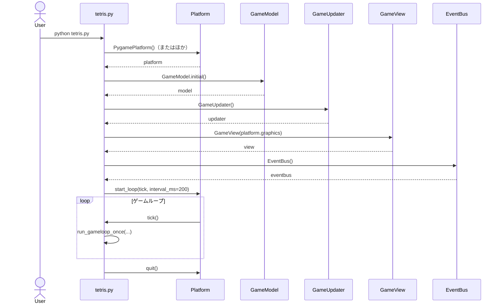
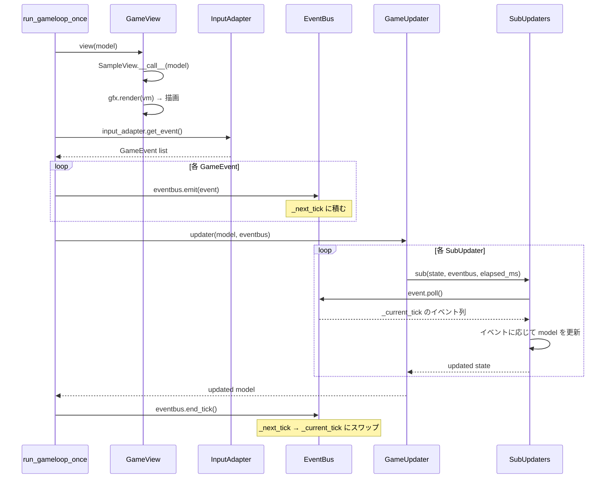
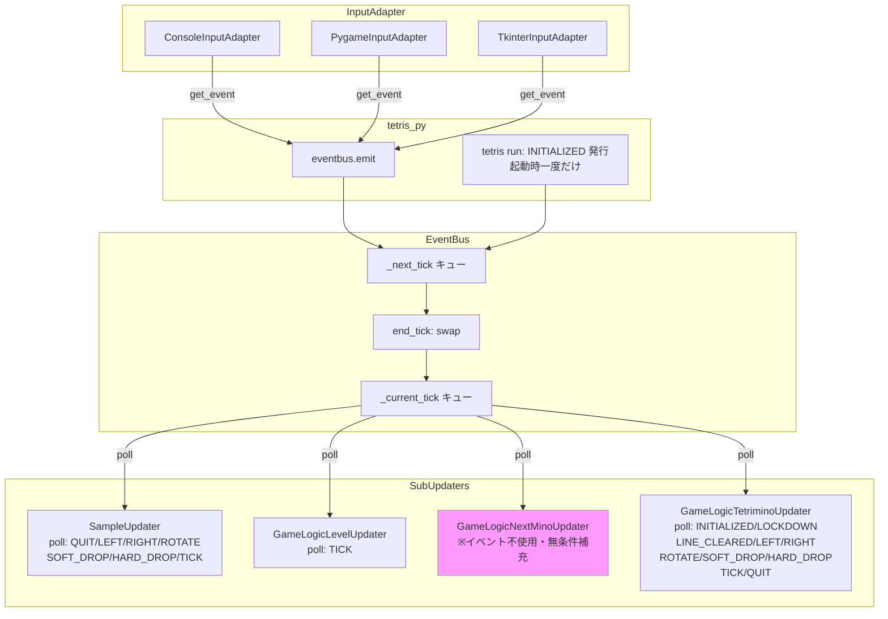
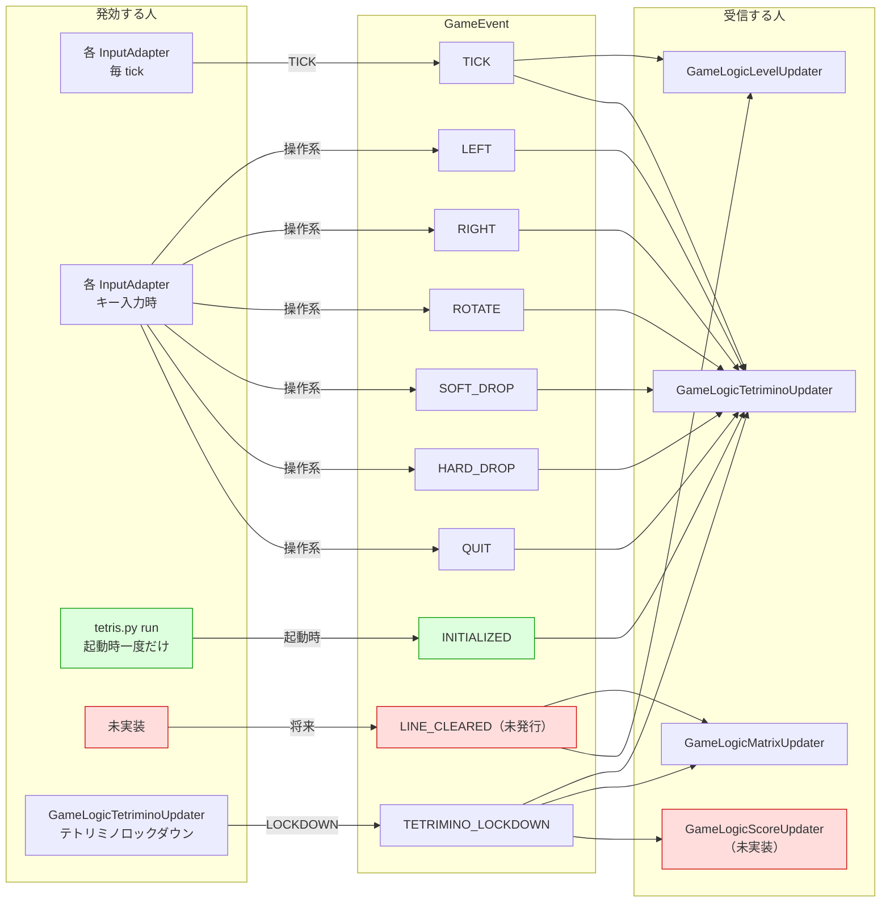

# SimpleTetris アーキテクチャ設計ドキュメント

## 目次

1. [プロジェクト概要](#1-プロジェクト概要)
2. [ディレクトリ構成](#2-ディレクトリ構成)
3. [アーキテクチャ概要](#3-アーキテクチャ概要)
4. [クラス図](#4-クラス図)
   - [ドメイン層](#41-ドメイン層)
   - [モデル層](#42-モデル層)
   - [Updater 層](#43-updater-層)
   - [View 層](#44-view-層)
   - [プラットフォーム抽象層](#45-プラットフォーム抽象層)
5. [シーケンス図](#5-シーケンス図)
   - [起動シーケンス](#51-起動シーケンス)
   - [1 tick の処理フロー](#52-1-tick-の処理フロー)
6. [イベント発行・購読マップ](#6-イベント発行購読マップ)
   - [GameEvent 一覧](#61-gameevent-一覧)
   - [発行者と購読者の対応表](#62-発行者と購読者の対応表)
   - [イベントフロー図](#63-イベントフロー図)

---

## 1. プロジェクト概要

SimpleTetris は Python で実装されたテトリスゲームです。  
MVC に近いレイヤード構成と、**EventBus** を介したイベント駆動設計を採用しています。

バックエンド（描画・入力）はアダプタパターンで抽象化されており、  
`tetris.py` の Platform を 1 行差し替えるだけで以下の 4 つのバックエンドを切り替えられます。

| Platform クラス       | 描画        | 入力       |
|-----------------------|-------------|------------|
| `ConsolePlatform`     | コンソール  | コンソール |
| `ConsolePygamePlatform` | コンソール | Pygame     |
| `TkinterPlatform`     | tkinter     | tkinter    |
| `PygamePlatform`      | Pygame      | Pygame     |

---

## 2. ディレクトリ構成

```
SimpleTetris/
├── tetris.py                        # エントリポイント・ゲームループ
├── domain.py                        # ドメインオブジェクト（Matrix, Tetromino）
├── GameModel.py                     # ゲームステートモデル
├── GameUpdater.py                   # Updater コーディネータ
├── GameView.py                      # View コーディネータ
├── updater_base.py                  # Updater 抽象基底クラス
├── view_base.py                     # View 抽象基底クラス
├── eventdef.py                      # イベント定義（GameEvent enum）
├── TetriminoDef.py                  # テトリミノ種別定義（TetriminoType enum）
│
├── AbstractModule/                  # プラットフォーム抽象層
│   ├── GraphicsAdapter.py           # 描画アダプタ基底 + 具体実装
│   ├── InputAdapter.py              # 入力アダプタ基底 + 具体実装
│   ├── Platform.py                  # Platform 基底 + 具体実装
│   └── common_tool/
│       └── EventBus.py              # EventBus（tick 単位イベントキュー）
│
├── GameLogicLevel/
│   └── GameLogicLevelUpdater.py     # レベル管理 Updater
│
├── GameLogicNextMino/
│   ├── GameLogicNextMinoUpdater.py  # ネクストミノキュー管理 Updater
│   └── NextMinoPermutation.py       # ランダム順列生成ユーティリティ
│
├── GameLogicTetrimino/              # ※実装途中
│   ├── GameLogicTetriminoUpdater.py # テトリミノ操作 Updater（WIP）
│   └── GameLogicTetriminoModel.py   # テトリミノモデル（WIP）
│
├── sample/                          # 参照実装（動作する暫定実装）
│   ├── SampleUpdater.py             # 参照 Updater 実装
│   └── SampleView.py                # 参照 View 実装
│
└── docs/                            # ドキュメント
```

---

## 3. アーキテクチャ概要

```
┌──────────────────────────────────────────────────────────────────┐
│                         tetris.py                                │
│  Platform.start_loop() が run_gameloop_once() を繰り返し呼び出す │
└────────────────────┬─────────────────────────────────────────────┘
                     │
         ┌───────────▼──────────────────────────────────────┐
         │             run_gameloop_once()                   │
         │                                                   │
         │  1. GameView(model)          ← 描画               │
         │  2. InputAdapter.get_event() ← 入力取得           │
         │  3. eventbus.emit(event)     ← EventBus に積む    │
         │  4. GameUpdater(model, bus)  ← 状態更新           │
         │  5. eventbus.end_tick()      ← tick 終了処理      │
         └───────────────────────────────────────────────────┘

  ┌─────────────┐   ┌──────────────┐   ┌───────────────────────┐
  │  GameModel  │   │  GameUpdater │   │       GameView        │
  │  (状態保持) │◄──│ (状態変換)   │   │  (状態→描画への変換)  │
  └─────────────┘   └──────┬───────┘   └───────────────────────┘
                            │
              ┌─────────────┼───────────────────┐
              ▼             ▼                   ▼
     SampleUpdater  GameLogicLevelUpdater  GameLogicNextMinoUpdater
                                           GameLogicTetriminoUpdater
```

**設計上のポイント:**

- `GameModel` はイミュータブルではなく、Updater が直接フィールドを更新するスタイル。
- `EventBus` は 1 tick 分のイベントを安全に受け渡すキュー。`emit()` は次 tick 用、`poll()` は現在 tick 用のキューを読む。
- `InputAdapter` は外部入力を `GameEvent` に変換するだけの薄いアダプタ。  
  実際の `EventBus.emit()` は `tetris.py` が担う。

---

## 4. クラス図

### 4.1 ドメイン層



### 4.2 モデル層



### 4.3 Updater 層



### 4.4 View 層



### 4.5 プラットフォーム抽象層



---

## 5. シーケンス図

### 5.1 起動シーケンス



### 5.2 1 tick の処理フロー



---

## 6. イベント発行・購読マップ

### 6.1 GameEvent 一覧

`eventdef.py` で定義されている `GameEvent` の全イベントとその用途：

| イベント名 | 説明 |
|-----------|------|
| `INPUTEVENT_INITIALIZED` | ゲーム開始時に一度だけ送られる（`tetris.py` `run()` が発行） |
| `INPUTEVENT_TICK` | 定期タイマー（毎 tick 必ず発行） |
| `INPUTEVENT_LEFT` | 左移動入力 |
| `INPUTEVENT_RIGHT` | 右移動入力 |
| `INPUTEVENT_ROTATE` | 回転入力 |
| `INPUTEVENT_SOFT_DROP` | ソフトドロップ入力 |
| `INPUTEVENT_HARD_DROP` | ハードドロップ入力 |
| `INPUTEVENT_QUIT` | 終了入力 |
| `INPUTEVENT_LINE_CLEARED` | ラインクリア発生時（※現在未発行） |
| `INPUTEVENT_TETRIMINO_LOCKDOWN` | テトリミノのロックダウン時（※現在未発行） |

> **※注意:** `INPUTEVENT_LINE_CLEARED`, `INPUTEVENT_TETRIMINO_LOCKDOWN` は  
> 購読側（`GameLogicTetriminoUpdater`）は対応済みだが、現在の実装では発行されていない。  
> `INPUTEVENT_INITIALIZED` は `tetris.py` の `run()` でループ開始前に一度だけ発行される。

### 6.2 発行者と購読者の対応表

| GameEvent | 発行者 | 購読者（反応するクラス） | 何をするか？  |
|-----------|--------|--------------------------|------------|
| `INPUTEVENT_INITIALIZED` | `tetris.py` `run()`（ループ開始前に一度だけ） | `GameLogicTetriminoUpdater` | 新しい ActiveTetrimino を作成してゲームを開始する |
| `INPUTEVENT_TICK` | `ConsoleInputAdapter` / `PygameInputAdapter` / `TkinterInputAdapter`（毎 tick 自動発行） | `SampleUpdater` / `GameLogicLevelUpdater` / `GameLogicTetriminoUpdater` | ActiveTetrimino を１つ落下させる |
| `INPUTEVENT_LEFT` | `ConsoleInputAdapter` / `PygameInputAdapter` / `TkinterInputAdapter` | `SampleUpdater` / `GameLogicTetriminoUpdater` | ActiveTetrimino を１つ左に移動させる |
| `INPUTEVENT_RIGHT` | `ConsoleInputAdapter` / `PygameInputAdapter` / `TkinterInputAdapter` | `SampleUpdater` / `GameLogicTetriminoUpdater` | ActiveTetrimino を１つ右に移動させる |
| `INPUTEVENT_ROTATE` | `ConsoleInputAdapter` / `PygameInputAdapter` / `TkinterInputAdapter` | `SampleUpdater` / `GameLogicTetriminoUpdater` | ActiveTetrimino を回転させる |
| `INPUTEVENT_SOFT_DROP` | `ConsoleInputAdapter` / `PygameInputAdapter` / `TkinterInputAdapter` | `SampleUpdater` / `GameLogicTetriminoUpdater` | ActiveTetrimino を１つソフトドロップさせる |
| `INPUTEVENT_HARD_DROP` | `ConsoleInputAdapter` / `PygameInputAdapter` / `TkinterInputAdapter` | `SampleUpdater` / `GameLogicTetriminoUpdater` | ActiveTetrimino をハードドロップさせる |
| `INPUTEVENT_QUIT` | （未実装・`GameLogicMatrixUpdater`付近から発行予定）  / `PygameInputAdapter` / `TkinterInputAdapter` | `SampleUpdater` / `GameLogicTetriminoUpdater` | ゲームを終了させる |
| `INPUTEVENT_LINE_CLEARED` | （未実装・`GameLogicTetriminoUpdater` 付近から発行予定） | `GameLogicScoreUpdater` / `GameLogicLevelUpdater` |  スコア計算し、レベル上昇処理を行う |
| `INPUTEVENT_TETRIMINO_LOCKDOWN` | （未実装・`GameLogicTetriminoUpdater._lock_and_spawn()` 付近から発行予定） | `GameLogicTetriminoUpdater` | ロックダウンを実施し |ライン消去し、新しい ActiveTetriminoを作成する |

> **発行の仕組み:**  
> InputAdapter は `get_event()` で `GameEvent` のリストを返すだけです。  
> `tetris.py` の `run_gameloop_once()` がそのリストを受け取り、  
> `eventbus.emit(event)` を呼んで EventBus に積みます。

### 6.3 イベントフロー図




